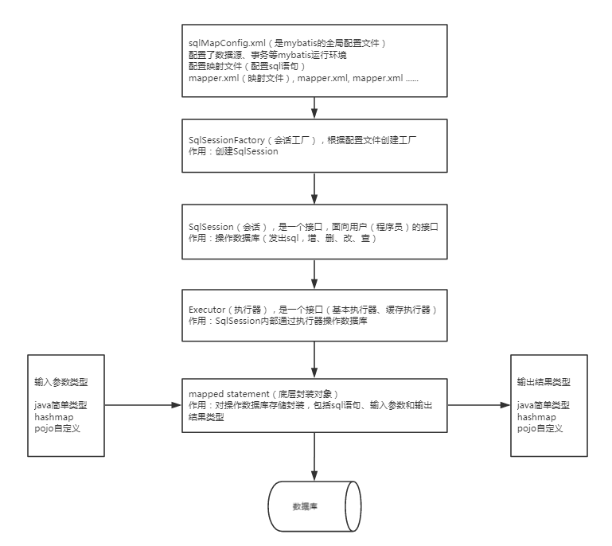

##<第二章>mybatis框架 
 

作者：*杨旭东* 
时间：*8/14/2017 11:04:05 PM*

### 1. mybatis是什么
* mybatis是一个持久层的框架，是apache下的顶级项目。
* 后来mybatis托管到google下，再后来托管到github下。
* mybatis让程序员将主要精力放在sql上，通过mybatis提供的映射方式，自由灵活生成（半自动化，大部分需要程序员编写sql）满足需要的sql语句。
* mybatis可以将向PreparedStatement中的输入参数自动进行输入映射，将查询结果集灵活映射成java对象。

### 2. mybatis框架原理图
---

