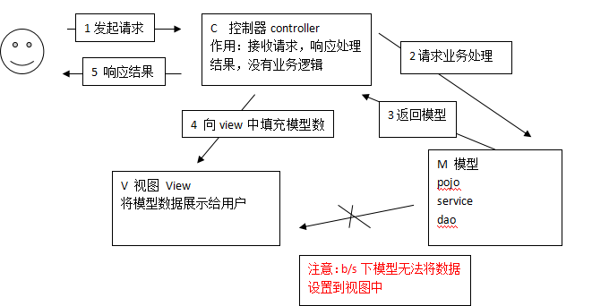

## springMVC介绍

如spring的整体结构得出spring web MVC和struts都属于web层框架。

### mvc

1. 用户发起request请求至控制器(Controller)
控制接收用户请求的数据，委托给模型进行处理
2. 控制器通过模型(Model)处理数据并得到处理结果
模型通常是指业务逻辑
3. 模型处理结果返回给控制器
4. 控制器将模型数据在视图(View)中展示
web中模型无法将数据直接在视图上显示，需要通过控制器完成。如果在C/S应用中模型是可以将数据在视图中展示的。
5. 控制器将视图response响应给用户
通过视图展示给用户要的数据或处理结果。

### springMVC

**架构流程**

1. 用户发送请求至前端控制器DispatcherServlet
2. DispatcherServlet收到请求调用HandlerMapping处理器映射器。
3. 处理器映射器根据请求url找到具体的处理器，生成处理器对象及处理器拦截器(如果有则生成)一并返回给DispatcherServlet。
4. DispatcherServlet通过HandlerAdapter处理器适配器调用处理器
5. 执行处理器(Controller，也叫后端控制器)。
6. Controller执行完成返回ModelAndView
7. HandlerAdapter将controller执行结果ModelAndView返回给DispatcherServlet
8. DispatcherServlet将ModelAndView传给ViewReslover视图解析器
9. ViewReslover解析后返回具体View
10. DispatcherServlet对View进行渲染视图（即将模型数据填充至视图中）。
11. DispatcherServlet响应用户

**组件说明**

以下组件通常使用框架提供实现：

- DispatcherServlet：前端控制器 **就是web.xml中配置，就是springMVC.xml文件**  
用户请求到达前端控制器，它就相当于mvc模式中的c，dispatcherServlet是整个流程控制的中心，由它调用其它组件处理用户的请求，dispatcherServlet的存在降低了组件之间的耦合性。
- HandlerMapping：处理器映射器 **配置即可** 
HandlerMapping负责根据用户请求找到Handler即处理器，springmvc提供了不同的映射器实现不同的映射方式，例如：配置文件方式，实现接口方式，注解方式等。
- Handler：处理器 **需要程序员去书写** 
Handler 是继DispatcherServlet前端控制器的后端控制器，在DispatcherServlet的控制下Handler对具体的用户请求进行处理。
由于Handler涉及到具体的用户业务请求，所以一般情况需要程序员根据业务需求开发Handler。
- HandlAdapter：处理器适配器 **配置即可** 
通过HandlerAdapter对处理器进行执行，这是适配器模式的应用，通过扩展适配器可以对更多类型的处理器进行执行。
- View Resolver：视图解析器 **配置即可**  
View Resolver负责将处理结果生成View视图，View Resolver首先根据逻辑视图名解析成物理视图名即具体的页面地址，再生成View视图对象，最后对View进行渲染将处理结果通过页面展示给用户。 springmvc框架提供了很多的View视图类型，包括：jstlView、freemarkerView、pdfView等。
一般情况下需要通过页面标签或页面模版技术将模型数据通过页面展示给用户，需要由程序员根据业务需求开发具体的页面。

通过上面的讲述，我们发现学框架其实就学配置，其实很多时候，能通过配置的方式解决的问题，我们不会选择通过代码去解决。框架就是对MVC理念做了全面的解释，统一了开发的规格，springMVC中我们做的是书写handler即可。